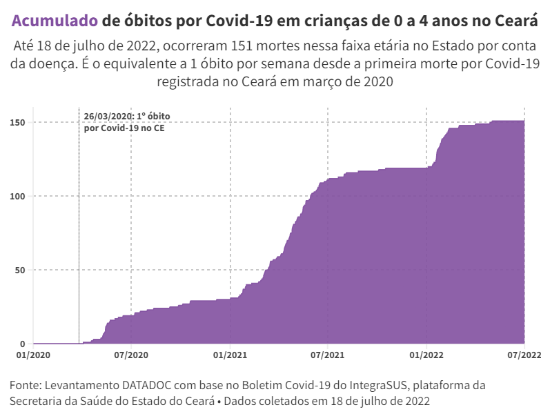

## Covid-19: Uma criança de 0 a 4 anos de idade morreu por semana no Ceará

Este repositório conta com códigos para coleta e análise de dados referentes aos óbitos por Covid-19 entre crianças menores de 5 anos no Ceará. A análise foi feita para a reportagem [Covid-19: Uma criança de 0 a 4 anos de idade morreu por semana no Ceará](https://mais.opovo.com.br/reportagens-especiais/2022/07/29/covid-19-uma-crianca-de-0-a-4-anos-de-idade-morreu-por-semana-no-ceara.html), fruto de colaboração entre a Central de Jornalismo de Dados (DATADOC) e o núcleo de Cotidiano do Jornal O POVO. A reportagem foi publicada na sexta-feira, 29 de julho de 2022, e o texto é assinado pelo repórter Gabriel Borges.



--------------------------------------

### Fonte e coleta de dados:

- [Boletim Covid-19, no IntegraSUS, plataforma da Secretaria da Saúde do Estado do Ceará (Sesa)](https://integrasus.saude.ce.gov.br/#/indicadores/indicadores-coronavirus/coronavirus-ceara)

### Metodologia

Inicialmente, foram raspados os dados de óbitos por Covid-19 no Ceará, por faixa etária, desde o início de 2020 até 18 de julho de 2022. Esse arquivo foi salvo como `20220718_df_obitos_por_idade.csv`. Em seguida, foram filtrados os óbitos entre crianças de 0 a 2 anos e de 3 a 4 anos de idade.

Com esse filtro, foram calculados os óbitos nessas idades por ano (2020, 2021 e 2022 — nesse último caso, até 18 de julho) e no período de 1º de janeiro a 18 de julho de cada um desses anos, além do percentual representado pelas faixas etárias (0 a 2 anos e 3 a 4 anos) nesses óbitos pela doença até o momento da análise.

### Arquivos gerados:

**_Dataframes_**
 - `20220718_df_obitos_00_04_acumulados_grafico.csv`:  Acumulado de óbitos por Covid-19 em crianças de 0 a 4 anos, no Ceará, de 1º de janeiro de 2020 a 18 de julho de 2022 ;
 - `20220718_df_obitos_00_04_comp_anos.csv`:  Óbitos por Covid-19 em crianças de 0 a 4 anos, no Ceará, por faixa etária, divididos por ano e por período (1º/jan a 18/jul).
 
 **_Visualizações_**
- [Acumulado de óbitos por Covid-19 em crianças de 0 a 4 anos no Ceará](https://public.flourish.studio/visualisation/10527332/)
- [Óbitos por Covid-19 no Ceará em crianças de 0 a 4 anos, por faixa etária e ano](https://public.flourish.studio/visualisation/10527141/)

--------------------------------------

#### Como utilizar:

Para executar o notebook com a coleta e processamento dos dados, é necessário um ambiente com *Python3* e dependências que podem ser instaladas via [Pip](https://pypi.org/project/pip/): 
```{python}
!pip install pandas
!pip install numpy
!pip install DateTime
```

### A central DATADOC

A Central de Jornalismo de Dados do O POVO (DATADOC) alia tecnologia e técnicas diversas de análises de dados para produzir um jornalismo de precisão para que você forme sua opinião com segurança. Nosso objetivo é fazer com que todos tenham acesso aos dados utilizados nas notícias que produzimos.

A DATADOC é composta por uma equipe de três jornalistas (sendo uma infografista), uma desenvolvedora front-end e um cientista da computação que coletam, enriquecem e disponibilizam as bases e códigos de cada reportagem para um jornalismo transparente e baseado em evidências.

 --------------------------------------
#### 🔥📰👩🏻‍💻 Se você gostou do nosso material, apoie assinando o OP+ e acompanhando o nosso trabalho.

#### 📝📨 Para feedback, dúvidas ou sugestões: datadoc@opovodigital.com

--------------------------------------
 
🎤🎼 Confira também outras produções recentes da central DATADOC: A matéria  ***Gilberto Gil 80 anos: uma viagem pelas composições e parcerias do baiano*** mostrou análises de composições e estatísticas das produções do artista nas plataformas YouTube e Spotify. A matéria está [disponível no O POVO Online](https://www.opovo.com.br/vidaearte/2022/06/24/gilberto-gil-80-anos-uma-viagem-pelas-composicoes-e-parcerias-do-baiano.html).